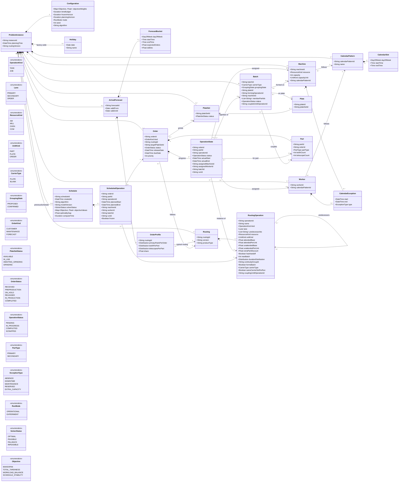
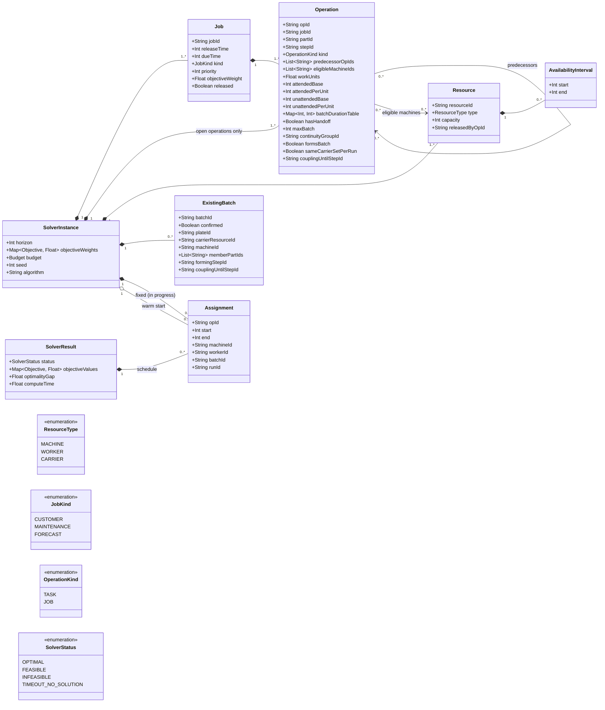

# Data Model

```mermaid
classDiagram
    direction LR

    %% ===== Request root =====
    class ProblemInstance {
        +String instanceId
        +DateTime planningTime
        +String routingVersion
    }

    class Configuration {
        +Map~Objective, Float~ objectiveWeights
        +Duration timeBudget
        +Duration frozenHorizon
        +Duration planningHorizon
        +RunMode mode
        +Int seed
        +String algorithm
    }

    %% ===== Master data: process definition (mirrors MES StepSpec) =====
    class Routing {
        +String routingId
        +String version
        +String productType
    }

    class RoutingOperation {
        +String operationId
        +String name
        +OperationKind kind
        +Lane lane
        +List~String~ predecessorIds
        +ResourceKind resource
        +UnitKind unitKind
        +Float attendedBase
        +Float attendedPerUnit
        +Float unattendedBase
        +Float unattendedPerUnit
        +Float extraPartDiscount
        +Boolean hasHandoff
        +Int maxBatch
        +Distribution durationDistribution
        +String continuityGroupId
        +Boolean formsBatch
        +CarrierType carrierType
        +Boolean sameCarrierSetPerRun
        +String couplingUntilOperationId
    }

    %% ===== Resources =====
    class Machine {
        +String machineId
        +ResourceKind resource
        +Int capacity
        +UnitKind capacityUnit
        +String calendarPatternId
    }

    class Worker {
        +String workerId
        +String calendarPatternId
    }

    class PlateSet {
        +String plateSetId
        +PlateSetStatus status
    }

    class Plate {
        +String plateId
        +String plateSetId
    }

    %% ===== Arrival forecast (expected future orders) =====
    class ArrivalForecast {
        +String forecastId
        +Date validFrom
        +Date validUntil
    }

    class ForecastBucket {
        +DayOfWeek dayOfWeek
        +Time startTime
        +Time endTime
        +Float expectedOrders
        +Float stdDev
    }

    class OrderProfile {
        +String routingId
        +Distribution primaryPartsPerOrder
        +Distribution teethPerPart
        +Distribution telescopesPerPart
        +Float share
    }

    %% ===== Calendars: recurring weekly pattern + exceptions =====
    class CalendarPattern {
        +String calendarPatternId
        +String name
    }

    class CalendarSlot {
        +DayOfWeek dayOfWeek
        +Time startTime
        +Time endTime
    }

    class CalendarException {
        +DateTime start
        +DateTime end
        +ExceptionType type
    }

    class Holiday {
        +Date date
        +String name
    }

    %% ===== Transactional data: orders, parts, progress =====
    class Order {
        +String orderId
        +OrderKind kind
        +String routingId
        +String targetPlateSetId
        +OrderStatus status
        +DateTime releaseDate
        +DateTime dueDate
        +Int priority
    }

    class Part {
        +String partId
        +String orderId
        +PartType partType
        +Int teethCount
        +Int telescopeCount
    }

    class OperationState {
        +String orderId
        +String partId
        +String operationId
        +OperationStatus status
        +DateTime actualStart
        +DateTime actualEnd
        +String assignedMachineId
        +String assignedWorkerId
        +String batchId
        +String runId
    }

    class Batch {
        +String batchId
        +CarrierType carrierType
        +GroupingState groupingState
        +String plateId
        +String formingOperationId
        +String machineId
        +List~String~ memberPartIds
        +OperationStatus status
        +String coupledUntilOperationId
    }

    %% ===== Schedule (output, and previous plan as input) =====
    class Schedule {
        +String scheduleId
        +DateTime createdAt
        +String algorithm
        +String modelVersion
        +SolverStatus solverStatus
        +Map~Objective, Float~ objectiveValues
        +Float optimalityGap
        +Duration computeTime
    }

    class ScheduledOperation {
        +String orderId
        +String partId
        +String operationId
        +DateTime plannedStart
        +DateTime plannedEnd
        +String machineId
        +String workerId
        +String batchId
        +String runId
        +Boolean frozen
    }

    %% ===== Enumerations =====
    class OperationKind {
        <<enumeration>>
        TASK
        JOB
    }

    class Lane {
        <<enumeration>>
        PRIMARY
        SECONDARY
        ORDER
    }

    class ResourceKind {
        <<enumeration>>
        AM
        MILL
        OVEN
        COM
    }

    class UnitKind {
        <<enumeration>>
        PART
        PLATE
        ORDER
    }

    class CarrierType {
        <<enumeration>>
        PLATE
        BLANK
    }

    class GroupingState {
        <<enumeration>>
        PROPOSED
        CONFIRMED
    }

    class OrderKind {
        <<enumeration>>
        CUSTOMER
        MAINTENANCE
        FORECAST
    }

    class PlateSetStatus {
        <<enumeration>>
        AVAILABLE
        IN_USE
        AWAITING_GRINDING
        GRINDING
    }

    class OrderStatus {
        <<enumeration>>
        RECEIVED
        PREPRODUCTION
        ON_HOLD
        RELEASED
        IN_PRODUCTION
        COMPLETED
    }

    class OperationStatus {
        <<enumeration>>
        PENDING
        IN_PROGRESS
        COMPLETED
        SCRAPPED
    }

    class PartType {
        <<enumeration>>
        PRIMARY
        SECONDARY
    }

    class ExceptionType {
        <<enumeration>>
        ABSENCE
        DOWNTIME
        MAINTENANCE
        RESERVED
        EXTRA_CAPACITY
    }

    class RunMode {
        <<enumeration>>
        OPERATIONAL
        EXPERIMENT
    }

    class SolverStatus {
        <<enumeration>>
        OPTIMAL
        FEASIBLE
        FALLBACK
        INFEASIBLE
    }

    class Objective {
        <<enumeration>>
        MAKESPAN
        TOTAL_TARDINESS
        WORKLOAD_BALANCE
        SCHEDULE_STABILITY
    }

    %% ===== Relationships =====
    ProblemInstance "1" *-- "1" Configuration
    ProblemInstance "1" *-- "1..*" Routing
    ProblemInstance "1" *-- "1..*" Machine
    ProblemInstance "1" *-- "1..*" Worker
    ProblemInstance "1" *-- "0..*" PlateSet
    ProblemInstance "1" *-- "1..*" Order
    ProblemInstance "1" *-- "0..*" Batch
    ProblemInstance "1" *-- "1..*" CalendarPattern
    ProblemInstance "1" *-- "0..*" Holiday : factory-wide
    ProblemInstance "1" o-- "0..1" Schedule : previousSchedule
    ProblemInstance "1" *-- "0..1" ArrivalForecast
    ArrivalForecast "1" *-- "1..*" ForecastBucket
    ArrivalForecast "1" *-- "1..*" OrderProfile
    OrderProfile "0..*" --> "1" Routing : typical routing

    Routing "1" *-- "1..*" RoutingOperation
    RoutingOperation "0..*" --> "0..*" RoutingOperation : predecessors

    CalendarPattern "1" *-- "1..*" CalendarSlot
    Machine "0..*" --> "1" CalendarPattern : follows
    Worker "0..*" --> "1" CalendarPattern : follows
    Machine "1" *-- "0..*" CalendarException
    Worker "1" *-- "0..*" CalendarException

    Order "0..*" --> "1" Routing : follows
    Order "1" *-- "1..*" Part
    Order "1" *-- "1..*" OperationState : progress
    OperationState "0..*" --> "1" RoutingOperation : instance of
    OperationState "0..*" --> "0..1" Part : for part
    OperationState "0..*" --> "0..1" Machine : assigned
    OperationState "0..*" --> "0..1" Worker : assigned
    OperationState "0..*" --> "0..1" Batch : member of

    Batch "0..*" --> "0..1" Machine : formed on
    Batch "0..*" --> "0..1" Plate : on plate
    PlateSet "1" *-- "1..*" Plate
    Order "0..*" --> "0..1" PlateSet : grinds
    Batch "0..*" --> "1..*" Part : couples

    Schedule "1" *-- "1..*" ScheduledOperation
    ScheduledOperation "0..*" --> "1" Order
    ScheduledOperation "0..*" --> "1" RoutingOperation
```

# Solver Model

```mermaid
classDiagram
    direction LR

    %% All times are Int = minutes relative to planningTime (t = 0)

    %% ===== Input =====
    class SolverInstance {
        +Int horizon
        +Map~Objective, Float~ objectiveWeights
        +Budget budget
        +Int seed
        +String algorithm
    }

    class Job {
        +String jobId
        +Int releaseTime
        +Int dueTime
        +JobKind kind
        +Int priority
        +Float objectiveWeight
        +Boolean released
    }

    class Operation {
        +String opId
        +String jobId
        +String partId
        +String stepId
        +OperationKind kind
        +List~String~ predecessorOpIds
        +List~String~ eligibleMachineIds
        +Float workUnits
        +Int attendedBase
        +Int attendedPerUnit
        +Int unattendedBase
        +Int unattendedPerUnit
        +Map~Int, Int~ batchDurationTable
        +Boolean hasHandoff
        +Int maxBatch
        +String continuityGroupId
        +Boolean formsBatch
        +Boolean sameCarrierSetPerRun
        +String couplingUntilStepId
    }

    class Resource {
        +String resourceId
        +ResourceType type
        +Int capacity
        +String releasedByOpId
    }

    class AvailabilityInterval {
        +Int start
        +Int end
    }

    class ExistingBatch {
        +String batchId
        +Boolean confirmed
        +String plateId
        +String carrierResourceId
        +String machineId
        +List~String~ memberPartIds
        +String formingStepId
        +String couplingUntilStepId
    }

    %% ===== Shared by input (fixed, warm start) and output =====
    class Assignment {
        +String opId
        +Int start
        +Int end
        +String machineId
        +String workerId
        +String batchId
        +String runId
    }

    %% ===== Output =====
    class SolverResult {
        +SolverStatus status
        +Map~Objective, Float~ objectiveValues
        +Float optimalityGap
        +Float computeTime
    }

    %% ===== Enumerations =====
    class ResourceType {
        <<enumeration>>
        MACHINE
        WORKER
        CARRIER
    }

    class JobKind {
        <<enumeration>>
        CUSTOMER
        MAINTENANCE
        FORECAST
    }

    class OperationKind {
        <<enumeration>>
        TASK
        JOB
    }

    class SolverStatus {
        <<enumeration>>
        OPTIMAL
        FEASIBLE
        INFEASIBLE
        TIMEOUT_NO_SOLUTION
    }

    %% ===== Relationships =====
    SolverInstance "1" *-- "1..*" Job
    SolverInstance "1" *-- "1..*" Operation : open operations only
    SolverInstance "1" *-- "1..*" Resource
    SolverInstance "1" *-- "0..*" ExistingBatch
    SolverInstance "1" *-- "0..*" Assignment : fixed (in progress)
    SolverInstance "1" o-- "0..*" Assignment : warm start

    Job "1" *-- "1..*" Operation
    Operation "0..*" --> "0..*" Operation : predecessors
    Operation "0..*" --> "0..*" Resource : eligible machines
    Resource "1" *-- "0..*" AvailabilityInterval

    SolverResult "1" *-- "0..*" Assignment : schedule
```